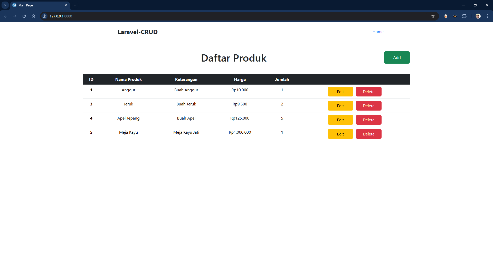
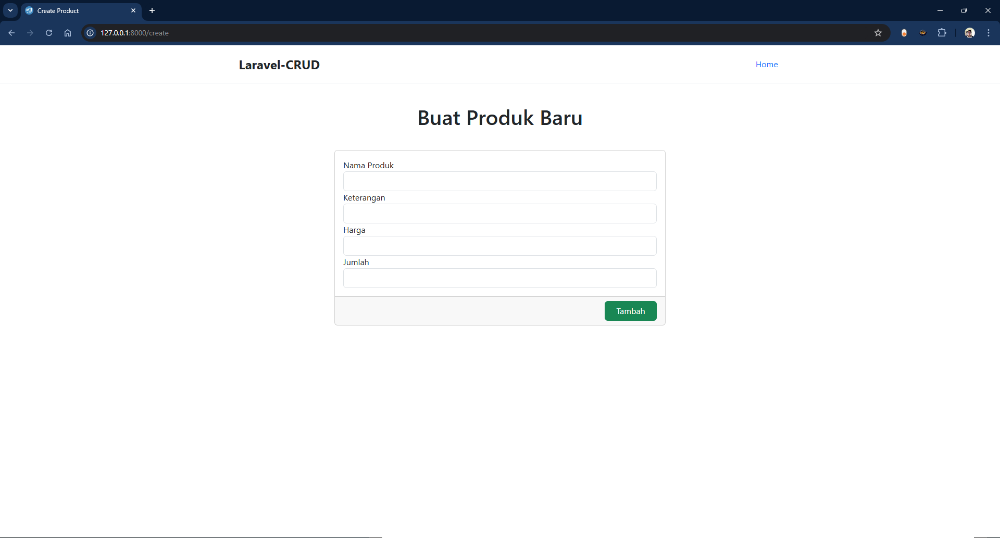
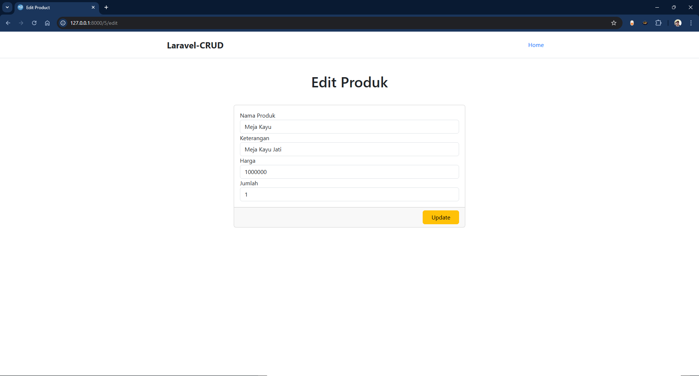

# **Aplikasi CRUD Sederhana Laravel**
This is a simple CRUD (Create, Read, Update, Delete) application built using Laravel.
## **Halaman Depan**

## **Halaman Create**

## **Halaman Edit**

# Fitur Aplikasi
- *Create*
    - Membuat/menambah data barang baru ke dalam sistem
    - Pengguna dapat mengisi formulir yang terdiri dari field nama barang dan harga barang. Setelah data diisi dan tombol "Simpan" ditekan, data akan disimpan ke dalam  basis data.
    - Contoh: Pengguna memasukkan nama barang "Laptop" dan harga "10,000,000". Setelah disimpan, barang tersebut muncul di daftar barang.
- *Read*
    - Menampilkan daftar barang yang tersimpan di dalam sistem
    - Sistem akan menampilkan data dalam bentuk tabel yang berisi kolom untuk nama barang, harga barang, dan opsi lainnya seperti "Edit" dan "Hapus"
    - Pengguna melihat daftar barang yang tersedia, misalnya:
        Laptop      - Rp10.000.000
        Smartphone  - Rp5.000.000
- *Update*
    - Memperbarui informasi barang yang sudah ada
    - Pengguna dapat memilih barang dari daftar yang ingin diperbarui, lalu mengedit informasi seperti nama atau harga barang. Setelah perubahan disimpan, data akan diperbarui di sistem
    - Pengguna mengedit harga "Laptop" dari Rp10.000.000 menjadi Rp9.500.000. Setelah disimpan, tabel daftar barang diperbarui dengan informasi baru
- *Delete*
    - Menghapus data barang yang tidak diperlukan
    - Pengguna dapat memilih barang dari daftar dan mengklik tombol "Hapus". Sistem akan mengonfirmasi tindakan ini sebelum menghapus data dari basis data
    - Pengguna menghapus data barang "Smartphone". Setelah konfirmasi, data barang tersebut hilang dari daftar barang

# Prasyarat
- [Docker](https://docs.docker.com/engine/install/)
- [Docker Compose](https://docs.docker.com/compose/install/)
# Petunjuk instalasi :

1. *Clone* repositori ini.

2. Jalankan perintah `docker-compose up -d` (atau `docker-compose up -d --build` jika ada perubahan pada *image*).

3. Jalankan perintah `docker exec web bash -c "chown -R www-data:www-data /var/www/html/storage /var/www/html/bootstrap/cache && chmod -R 775 /var/www/html/storage /var/www/html/bootstrap/cache"` untuk memberikan izin dan kepemilikan kepada *container*.

4. Jalankan perintah `docker-compose exec web php artisan migrate` untuk menjalankan migrasi database.

5. Aplikasi sudah berjalan dan dapat dicek dengan *command* `docker ps` atau `docker-compose ps`.

6. Aplikasi dapat diakses menggunakan *port* yang sudah ditentukan (*default port* 8000), contoh cara mengakses `localhost:8000` jika aplikasi berjalan di lokal.

# Penjelasan `Dockerfile`
- `FROM php:8.2-apache as web`
Menentukan *base image* yang digunakan untuk *container* (PHP dengan Apache sebagai server web).

- `RUN apt-get update && apt-get install -y ...`
Menginstal *dependencies* sistem yang diperlukan (seperti zip, libzip-dev).

- `RUN docker-php-ext-install pdo_mysql zip`
Menginstal ekstensi PHP yang dibutuhkan oleh Laravel.

- `ENV APACHE_DOCUMENT_ROOT=/var/www/html/public`
Mengonfigurasi Apache untuk melayani file dari direktori `public` milik Laravel.

- `COPY . /var/www/html`
Menyalin kode aplikasi ke dalam container.

- `RUN composer install`
Menginstal *dependencies* PHP menggunakan Composer.

- `RUN chown -R www-data:www-data /var/www/html/storage /var/www/html/bootstrap/cache`
Mengatur izin akses yang benar untuk direktori storage dan cache milik Laravel. (Langkah 3 pada Petunjuk Instalasi juga dilakukan untuk menghindari *error* mengenai izin akses) 

# Penjelasan `docker-compose.yml`

## Bagian `services`
Bagian ini mendefinisikan layanan (*services*) yang akan dijalankan dalam containers. Pada file ini, ada dua layanan utama: web dan db.
### Service `web`
1. `image: app-name:latest`
    - Menentukan nama dan versi *image* Docker yang digunakan untuk layanan ini (dalam hal ini: app-name:latest).

2. `build:`
    - Menginstruksikan Docker untuk membangun *image* dari Dockerfile yang ada di direktori saat ini (`context: .`) dengan target web yang didefinisikan dalam Dockerfile.

3. `env_file: - .env`
    - Memuat variabel *environment* dari file `.env` untuk digunakan di dalam container.

4. `ports: - "8000:80"`
    - Menghubungkan port `80` di dalam container ke port `8000` di *host*.
    - Akses aplikasi melalui http://localhost:8000.

5. `volumes: - .:/var/www/html`
    - Volume ini menyinkronkan direktori proyek di *host* `(.)` ke `/var/www/html` di dalam *container*.
    - Memungkinkan perubahan di kode pada *host* langsung tampil di dalam *container*.

6. `depends_on: - db`
    - Mengindikasikan bahwa layanan web bergantung pada layanan `db`.
    - Docker Compose memastikan *container database* (`db`) berjalan lebih dulu sebelum container `web`.

### Service `db`

1. `platform: "linux/amd64"`
    - Menentukan *platform* arsitektur untuk *container*. Dalam hal ini, menggunakan Linux dengan arsitektur amd64.

2. `image: mysql:5.7`
    - Menggunakan *image* MySQL versi 5.7 untuk layanan *database*.

3. `env_file: - .env`
    - Memuat variabel *environment* dari file `.env` untuk konfigurasi *database*.

4. `environment:`

    - Mendefinisikan variabel *environment* untuk konfigurasi database:
        - `MYSQL_ROOT_PASSWORD:` *Password* untuk *user* `root` MySQL.
        - `MYSQL_DATABASE:` Nama *database* yang akan dibuat secara otomatis.
        - `MYSQL_USER:` *User database* tambahan yang akan dibuat.
        - `MYSQL_PASSWORD:` *Password* untuk user tambahan tersebut.
    - Variabel `${DB_DATABASE}`, `${DB_USERNAME}`, dan `${DB_PASSWORD}` diambil dari file `.env`.

5. `ports: - "3306:3306"`

    - Menghubungkan port `3306` di dalam *container* (port *default* MySQL) ke port `3306` di *host*.
    - Akses *database* melalui `localhost:3306`.

6. `volumes: - dbdata:/var/lib/mysql`
    - Menyimpan data MySQL di volume bernama `dbdata` untuk menjaga data tetap ada (*persistent*) meskipun *container* dihentikan.

## Bagian `volumes`
1. `volumes: dbdata:`
    - Mendefinisikan volume bernama `dbdata` untuk menyimpan data MySQL.
    - Volume ini digunakan oleh layanan `db` pada path `/var/lib/mysql`.

